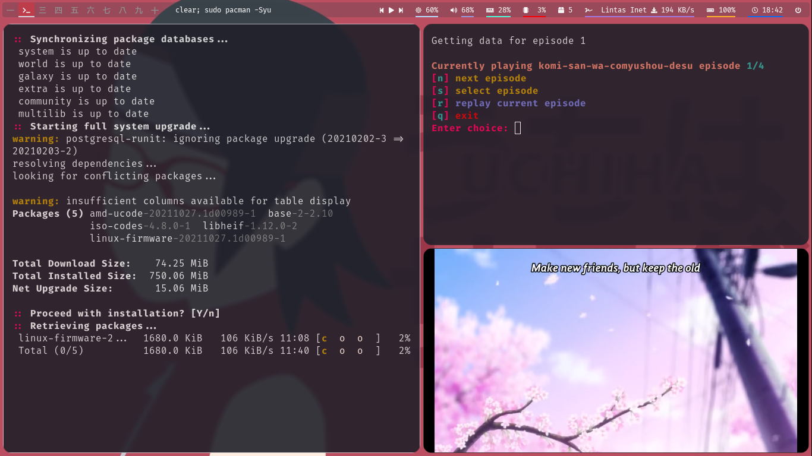
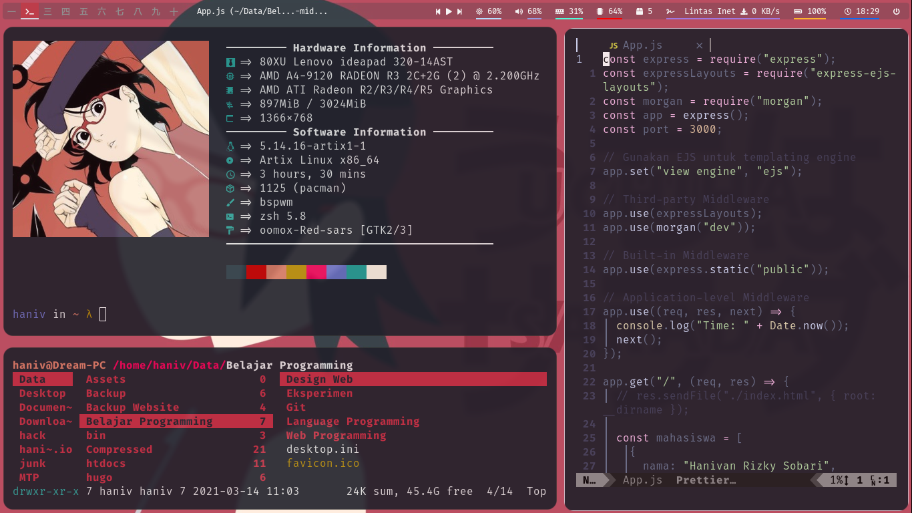

# Hello there 👋

Welcome to my personal dotfiles, hope you find something useful here ^-^

I made this dotfiles structure as neat as possible. Yaa~, besides making it easier for myself, it also makes it easier for others to copy my setup.

### My Rig

───────── Hardware Information ─────────

- **Device:** 80XU Lenovo Ideapad 320-14AST 💻
- **CPU:** AMD A4-9120 2.2Ghz ⚙️
- **GPU:** AMD ATI Radeon R3 ⚔️
- **RAM:** 16GB 🌡️

───────── Software Information ─────────

- **OS:** [Artix Linux](https://artixlinux.org) Runit with [Zen Kernel](https://github.com/zen-kernel/zen-kernel) ❄️
- **WM:** [bspwm](https://github.com/baskerville/bspwm) 🎨
- **DE:** [xfce4](https://wiki.archlinux.org/title/xfce) 🐭
- **SHELL:** [zsh](https://wiki.archlinux.org/title/Zsh) with [oh-my-zsh](https://github.com/ohmyzsh/ohmyzsh) 🐚
- **Terminal:** [kitty](https://github.com/kovidgoyal/kitty) 🐱
- **Panel:** [polybar](https://github.com/polybar/polybar) using [nerd fonts](https://github.com/ryanoasis/nerd-fonts) glyphs icons 🍜
- **Compositor:** [picom](https://aur.archlinux.org/packages/picom-jonaburg-git) ✨
- **Notify Deamon:** [Dunst](https://wiki.archlinux.org/title/Dunst) ✉️
- **Application Launcher:** [rofi](https://wiki.archlinux.org/title/Rofi) 🚀
- **File Manager:** [Thunar](https://wiki.archlinux.org/title/Thunar) 🔖
- **Text Editor:** [Neovim](https://wiki.archlinux.org/title/Neovim) 📄

## 🍅 Red-sars





**Running Application:**

- Terminal Update
- [ani-cli](https://github.com/pystardust/ani-cli)
- neofetch
- ranger
- neovim

## 🥁 DBlue-naka

_Comming Soon_

[WARNING!]: Support for Arch Linux based systems only (instalation via pacman & aur)

### Download

```
mkdir -p ~/Documents/git && git clone --depth=1 https://github.com/Hanivan/dotfiles.git ~/Documents/git/dotfiles && cd ~/Documents/git/dotfiles
```

### Instalation

You can run `setup.sh` file

```
./setup.sh <THEME_NAME>
```

(Please backup your configuration before. Because this command will **replace your own config** and install all necessary packages, icons, and fonts)

#### For Neovim

You can install extension & language server using [coc.nvim](https://github.com/neoclide/coc.nvim). In this setup I have configured several server languages, including:

- coc-tserver (JavaScript & TypeScript)
- coc-tslint-plugin (TypeScript)
- coc-python (Python)
- coc-prettier (Auto Format)
- coc-phpls (PHP)
- coc-json (JSON)
- coc-html (HTML)
- coc-emmet (Shorthand for HTML)
- coc-diagnostic (Diagnostic for language servers)
- coc-css (CSS)
- coc-clangd (C/C++)

You just need to run this command on neovim

```
:CocInstall coc-tsserver coc-tslint-plugin coc-python coc-prettier coc-phpls coc-json coc-html coc-emmet coc-diagnostic coc-css coc-clangd
```

### Keybinds

This table insipired by [@bandithijo](https://github.com/bandithijo/nvimrc)

#### Neovim

**MODE:**<br>
**N**: Normal, **I**: Insert, **T**: Terminal, **C**: Command

**NOTE:**<br>
<kbd>a</kbd> <kbd>b</kbd> means "press <kbd>a</kbd> (release), then press <kbd>b</kbd>"<br>
<kbd>a</kbd>+<kbd>b</kbd> means "press <kbd>a</kbd> (hold it), then press <kbd>b</kbd>"

| Function                         | Mode | Key Name                                       |
| -------------------------------- | ---- | ---------------------------------------------- |
| Leader                           | N    | <kbd>Space</kbd>                               |
| Buffer next                      | N    | <kbd>Alt</kbd>+<kbd>Tab</kbd>                  |
| Buffer previous                  | N    | <kbd>Alt</kbd>+<kbd>Shift</kbd>+<kbd>Tab</kbd> |
| Buffer close                     | N    | <kbd>Ctrl</kbd>+<kbd>w</kbd>                   |
| Search keyword forward           | N    | <kbd>n</kbd>                                   |
| Search keyword backward          | N    | <kbd>Shift</kbd>+<kbd>n</kbd>                  |
| Telescope find_files             | N    | <kbd>Ctrl</kbd>+<kbd>p</kbd>                   |
| File Explorer toggle             | N    | <kbd>Ctrl</kbd>+<kbd>b</kbd>                   |
| Move window pane focus to left   | N    | <kbd>Control</kbd>+<kbd>h</kbd>                |
| Move window pane focus to down   | N    | <kbd>Control</kbd>+<kbd>j</kbd>                |
| Move window pane focus to up     | N    | <kbd>Control</kbd>+<kbd>k</kbd>                |
| Move window pane focus to right  | N    | <kbd>Control</kbd>+<kbd>l</kbd>                |
| Exit from terminal mode          | T    | <kbd>Esc</kbd>                                 |
| Increase window vertical split   | N    | <kbd>Ctrl</kbd>+<kbd>Shift</kbd>+<kbd>z</kbd>  |
| Decrease window vertical split   | N    | <kbd>Ctrl</kbd>+<kbd>z</kbd>                   |
| Increase window horizontal split | N    | <kbd>Ctrl</kbd>+<kbd>Shift</kbd>+<kbd>x</kbd>  |
| Decrease window horizontal split | N    | <kbd>Ctrl</kbd>+<kbd>x</kbd>                   |
| Emmet leader key                 | N    | <kbd>Control</kbd>+<kbd>Space</kbd>            |
| Compile&Run C++                  | N    | <kbd>F5</kbd>                                  |
| Compile&Run C++ (OOP)            | N    | <kbd>F6</kbd>                                  |
| Compile SCSS                     | N    | <kbd>Ctrl</kbd>+<kbd>s</kbd>                   |
| Run Live Server                  | N    | <kbd>Alt</kbd>+<kbd>l</kbd>                    |

**Note For Compiler On Neovim**

For C++ OOP. You must create folder structure like this.

```
haniv in 05-Methods λ tree .
.
├── bin
│   └── Main
└── src
    └── Main.cpp
```

Or you can change formula for copile C++ OOP at _~/.zshrc_. Search for `oopcpp`. Also you can change formula for compile C++ at _~/.config/nvim/general/settings.vim_. Search for `CompileCPP` function. For SCSS compile formula, you can search for `Auto Compiling Sass`

## Attention!!

Because I use a non-systemd distro. Expected if there is an error in this setup. You can fix it yourself. Thank You

### Don't Forget To Follow

Hey! If you want to know more about me. You can follow some of the social media that I have below:

- **YouTube:** [Lintasan Video](https://youtube.com/c/LintasanVideo)
- **LinkedIn:** [@hanivanrizky](https://id.linkedin.com/in/hanivanrizky)
- **Instagram:** [@hanivanrizky](https://instagram.com/hanivanrizky)
